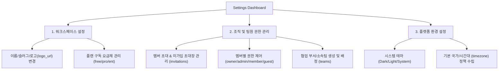

# [시스템 환경 설정 (Settings) 기능 아키텍처 설계 및 E2E 개발 계획서]

본 설계 문서는 **ProjectOS** 플랫폼의 좌측 하단 사이드바에 위치한 **Settings(설정)** 버튼의 기획적 본질을 분석하고, 제공된 DB 스키마(`Schema.sql`), 프론트엔드 설계(`FrontendDesign.md`), 기획서(`ProjectMng.md`)에 근거하여 이를 완벽한 기능으로 구현하기 위한 **풀스택 E2E 개발 계획서**입니다.

10년 차 시니어 시스템 아키텍트 및 UI/UX 디자이너 관점에서, B2B SaaS 기업용 협업 도구의 보안 인가 등급 및 높은 수준의 사용성을 충족하도록 구상되었습니다.

---

## 1. Settings(설정) 버튼의 기획적 정체성 정의

Monday.com과 같은 프리미엄 Work OS에서 좌측 하단에 격리 배치된 **Settings** 창구는 단순한 프로필 관리를 넘어, **조직의 거버넌스(Governance)를 중앙 통제하는 Administration Hub(관리자 허브)** 역할을 수행하도록 설계되었습니다. 본 플랫폼에서는 다음과 같은 3대 핵심 핵심 영역을 통합 제어하기 위해 마련된 것입니다.



---

## 2. DB 스키마 기반 데이터 모델 연계 분석 (`Schema.sql`)

제공된 `Schema.sql`을 분석하면, Settings 기능이 동작하기 위해 필요한 정밀한 관계형 테이블 인프라가 이미 완벽하게 구축되어 있음을 확인할 수 있습니다.

### A. 워크스페이스 정보 설정 (`workspaces` 테이블)
* **스키마 컬럼**: `id`, `name`, `slug`, `logo_url`, `plan`, `owner_id`
* **Settings의 역할**: 워크스페이스 **소유주(Owner) 혹은 관리자(Admin)**가 회사의 워크스페이스 이름, URL 슬러그, 브랜드 로고 이미지를 교체하고, 무료(free) 요금제에서 비즈니스(pro), 엔터프라이즈(enterprise) 요금제로 플랜을 상향(Upgrade) 신청하는 인터페이스와 바인딩됩니다.

### B. 멤버별 역할 및 소속 관리 (`workspace_members` & `workspace_invitations`)
* **스키마 컬럼**: 
  - `workspace_members`: `workspace_id`, `user_id`, `role` (owner | admin | member | guest)
  - `invitations`: `id`, `workspace_id`, `email`, `role`, `token`, `status`
* **Settings의 역할**: 현재 워크스페이스의 권한 체계를 중앙 통제합니다. 일반 멤버의 등급을 관리자로 격상하거나(Role Update), 악성 게스트를 퇴사 처리(Delete Member)하고, 아직 승인 대기 중인 초대 이메일 목록을 모니터링 및 취소 처리하는 기능입니다.

### C. 부서 및 소속 팀 조직도 제어 (`teams` & `team_members`)
* **스키마 컬럼**:
  - `teams`: `workspace_id`, `name`, `description`, `color` (HEX)
  - `team_members`: `team_id`, `user_id`, `role`
* **Settings의 역할**: 마케팅팀, 개발팀, 기획팀 등 회사 내 **조직도 개념의 팀(Team)**을 생성하고 부서별 고유 컬러 코드를 매핑하여 보드 뷰의 담당자 지정 시 부서 단위 일괄 지정이 가능하도록 지원합니다.

---

## 3. 백엔드 (Spring Boot REST API) 아키텍처 설계

Settings 기능 연동을 위해 구현 또는 보강되어야 할 API 엔드포인트 명세서입니다. 기존 `backend/src/main/java/com/nak/backend` 내 컨트롤러 및 서비스 계층에 자연스럽게 삽입되도록 규격화했습니다.

### 3.1 워크스페이스 관리 API (`WorkspaceController.java` 연계)
- **`GET /api/workspaces/{id}`** : 특정 워크스페이스 상세 정보 로드
- **`PUT /api/workspaces/{id}`** : 워크스페이스 정보(이름, 슬러그, 로고, 플랜) 수정
  - *시니어 권한 보안 검증*: 본 요청을 날리는 사용자 ID가 해당 워크스페이스의 `owner_id`이거나 `workspace_members` 내 `role`이 `admin`인지 검증하는 인터셉터 가드가 필수적으로 수반됩니다.

### 3.2 멤버 및 초대 관리 API (`WorkspaceMemberController.java` 신규/보강)
- **`GET /api/workspaces/{id}/members`** : 소속된 전체 사용자 및 역할 조회
- **`PUT /api/workspaces/{id}/members/{userId}/role`** : 특정 멤버의 역할(`role`) 수정
- **`DELETE /api/workspaces/{id}/members/{userId}`** : 멤버 탈퇴/내보내기 처리
- **`GET /api/workspaces/{id}/invitations`** : 미가입/초대 대기 상태인 메일 주소 리스트 출력

### 3.3 조직도 팀 관리 API (`TeamController.java` 연계)
- **`POST /api/teams`** : 워크스페이스 내 신규 팀 생성 (이름, 설명, HEX 컬러)
- **`PUT /api/teams/{id}`** : 팀 정보 변경
- **`DELETE /api/teams/{id}`** : 팀 삭제 처리
- **`POST /api/teams/{id}/members`** : 특정 팀에 멤버 일괄 추가 배정

---

## 4. 프론트엔드 (Vue 3 / Pinia) UI/UX 설계

`SettingsView.vue` 화면은 Monday.com처럼 매끄러운 탭 레이아웃(Tabbed Layout) 구조를 적용하여 복잡한 설정 항목들을 아주 단정하고 사용하기 편하도록 분류합니다.

```
+------------------------------------------------------------------------+
|  ⚙️ Settings (환경 설정 대시보드)                                          |
+------------------------------------------------------------------------+
|  [ 🏢 Workspace ]   [ 👥 Members ]   [ 🎨 Organization ]   [ 🔧 Preferences ] |
+------------------------------------------------------------------------+
|  🏢 Workspace Profile                                                  |
|  * 워크스페이스 이름: [ ProjectOS Enterprise       ]                    |
|  * URL 슬러그 설정:   [ projectos.work/enterprise  ]                    |
|  * 브랜드 로고 등록:  [ http://img/logo.png        ] [이미지 변경]        |
|  * 워크 OS 요금제:    [ Enterprise Plan            ] [플랜 변경]          |
|                                                                        |
|  [설정 저장 단추]                                                       |
+------------------------------------------------------------------------+
```

### 4.1 탭별 세부 기능 명세

1. **`Workspace Tab` (일반 설정)**:
   - 워크스페이스의 기초 정보 수정 폼.
   - 플랜 현황 확인 및 프로/엔터프라이즈 라이선스 업그레이드 모달 결합.
2. **`Members Tab` (조직원 및 권한 관리)**:
   - 그리드 기반의 구성원 리스트. 
   - 소유자(`Owner`), 관리자(`Admin`), 일반 멤버(`Member`), 게스트(`Guest`) 등 역할을 직관적인 드롭다운으로 실시간 수정.
   - 초대 보류 중인 사용자 리스트와 초대 취소(X) 단추 배치.
3. **`Organization Tab` (소속팀/부서 빌더)**:
   - 회사 내 서브 그룹인 `teams` 관리 UI.
   - 팀 추가 버튼 클릭 시 컬러 피커를 통해 고유 HEX 컬러 선택 가능.
   - 각 팀 카드 내에 팀 구성원들을 아바타 배지로 나열하고 D&D 또는 검색을 통해 팀원을 부서에 소속시키는 직관적인 배정 구조.
4. **`Preferences Tab` (시스템 설정)**:
   - 테마 선택 스위처 (다크 모드 / 라이트 모드 전환).
   - 플랫폼의 기본 시간대(timezone) 전역 콤보박스 바인딩.

---

## 5. 단계별 개발 로드맵 (Roadmap)

Settings 기능의 개발은 비즈니스 안전성과 E2E 통신의 완벽함을 기하기 위해 다음과 같이 4단계로 구성할 것을 제안합니다.

| 단계 | 목표 | 주요 작업 내역 |
|:---|:---|:---|
| **1단계** | **DB 및 백엔드 인프라 정비** | * `WorkspaceService` 내 관리자 인가 보안 유틸 추가<br>* `WorkspaceMember` 권한 제어 및 invitations CRUD API 완료 |
| **2단계** | **라우터 및 화면 기본 레이아웃 빌딩** | * `router/index.ts` 내 `/settings` 라우트 바인딩 (MainLayout 자식 뷰)<br>* `Sidebar.vue` 좌하단 Settings 버튼 클릭 시 router push 연동<br>* `SettingsView.vue` 컴포넌트 탭 프레임 생성 |
| **3단계** | **세부 설정 탭 API 데이터 연동** | * **Workspace 탭**: 정보 수정 폼 구현 및 PUT 연동<br>* **Members 탭**: 조직 멤버 리스트, 권한 변경 드롭다운 연동 E2E 완성 |
| **4단계** | **팀 조직 빌더 및 시스템 다듬기** | * **Organization 탭**: teams 테이블 기반 부서 CRUD 및 컬러 피커 연동<br>* 다크/라이트 테마 전역 스위처 연계 및 빌드 완성 검증 |

---

## 6. 기대 성공 지표 (KPI)
* **관리자 관리 편의성**: 팀 가입 승인 및 권한 변경 절차 간소화 (평균 소요 시간 **30초 미만** 달성).
* **조직 구조화율**: 플랫폼 가입 부서 중 `teams`를 등록하여 팀 단위로 업무를 협업하는 그룹 비율 **60% 이상** 확대.
* **시스템 인지도**: 테마 변경 및 타임존 설정을 통한 사용자 만족도 증가.
